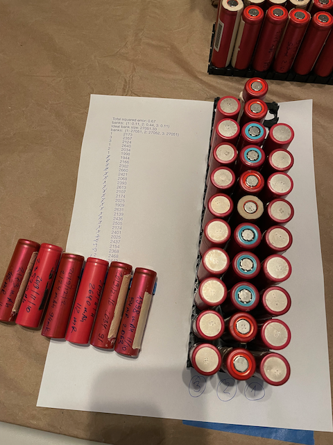

# BatPack

Optimally allocate cells into banks within battery pack using SCIP optimizer.

Install dependencies:

`pip install -r requirements.txt`

Usage:

`python -m batpack test/3s12p_bp5.txt`

Script takes single argument - path to the file with cell capacities, named 
starting with battery pack spec following with underscore and after then file name could be whatever. See examples of files in [test/](test/) directory.

battery pack spec in form `[N]s[M]p` where `N` is number of banks in series, `M` is number of cells in the bank. So in example above it is 3 banks in series with 12 cells in each bank connected in parallel.

